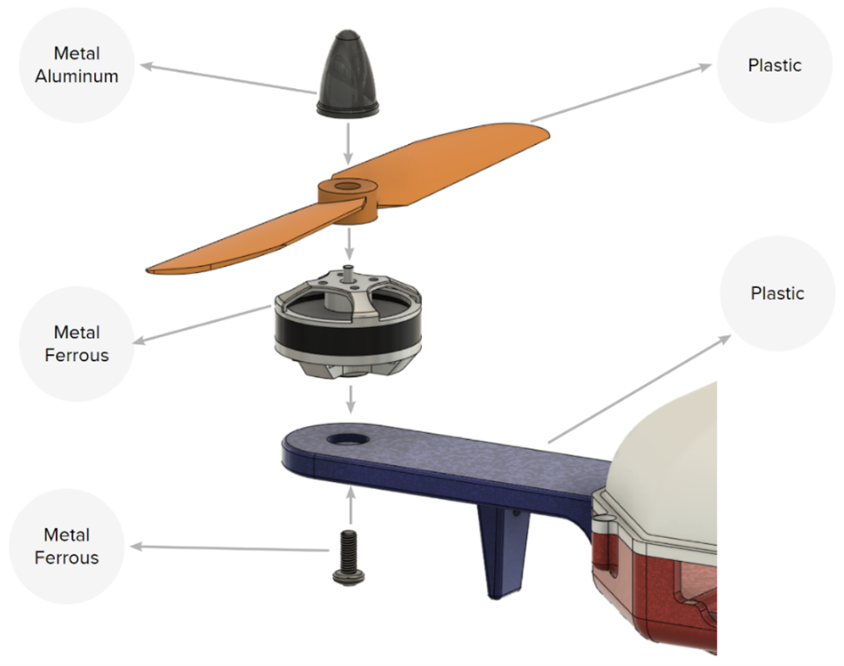

<div align="center" style="font-size: 22pt;"> 
    <strong>🥇 🥈 🥉 2023 IDETC Hackathon <br/> Automating Material Selection for Product Design</strong>  
</div>
<br/>
<div align="center">
    
</div>
  
<br/>
Welcome to the Autodesk problem statement for the 2023 IDETC hackathon!
<br/>
<br/>

<div align="center">
  <strong>Material Category Definition Table</strong>
  <table border="1" style="width: 100%; text-align: center; margin: auto;">
    <thead>
        <tr>
            <th><strong>Material Category</strong></th>
            <th>Definition</th>
            <th>Example(s)</th>
        </tr>
    </thead>
    <tbody>
        <tr>
            <td>Metal_Aluminum</td>
            <td>Aluminum-based metal</td>
            <td>Aluminum alloy</td>
        </tr>
        <tr>
            <td>Metal_Ferrous</td>
            <td>Ferrous metal (excluding carbon steel)</td>
            <td>Cast iron</td>
        </tr>
        <tr>
            <td>Metal_Ferrous_Steel</td>
            <td>Carbon steel</td>
            <td>Stainless steel</td>
        </tr>
        <tr>
            <td>Metal_Non-Ferrous</td>
            <td>Non-Ferrous metal</td>
            <td>Platinum, silver</td>
        </tr>
        <tr>
            <td>Other</td>
            <td>Uncategorized material</td>
            <td>Glass, fabric, ceramic</td>
        </tr>
        <tr>
            <td>Plastic</td>
            <td>Plastic</td>
            <td>Thermoplastic</td>
        </tr>
        <tr>
            <td>Wood</td>
            <td>Natural and engineered wood</td>
            <td>Softwood</td>
        </tr>
    </tbody>
</table>


</div>
  
## 🤔 Problem Statement
- The hackathon's goal is to predict the `material_category` for each body in the [test set](dataset/test_data). The [train data](dataset) contains material category labels for each body of each assembly in the `assembly.json` files.
- Link to [PDF](Autodesk%20Hackathon%20Problem%20Statement%202023.pdf) with more information.

## ⚙️ Instructions for Setup and Run 
- Clone the repository (e.g., ssh version below):
```
$ git clone git@github.com:bankh/IDETC23-Autodesk-hackathon.git
```
- Setup and activate conda environment:  
```
$ conda create --name=idetc python=3.8
$ source activate idetc
```
- Install required libraries:  
```
$ cd IDETC23-Autodesk-hackathon
$ pip install -r requirements.txt
```

__Note:__ One can find the setup of the Docker container for AMD-based GPUs [here](https://github.com/bankh/GPU_Compute/blob/main/Docker_images/AMD/readMe.md).  

## 💾 Dataset
- [Download instructions](dataset). Please note that the dataset has been modified for this hackathon, and you should only use data from these download instructions in your implementation.
  - The data has been modified to include in each `assembly.json` file a `material_category` label for each body. This label, which describes the material category of the body as defined in the table above, can be used to train your model.
- **Dataset Specifications:** Please refer to [the original documentation](https://github.com/AutodeskAILab/Fusion360GalleryDataset/blob/master/docs/assembly.md) of the Fusion 360 Gallery Dataset for information about the structure of the data in `assembly.json` and to find out more about the features in the dataset.

The assembly data is provided in a JSON file with the following top-level structure ([from the original documentation](https://github.com/AutodeskAILab/Fusion360GalleryDataset/blob/master/docs/assembly.md)) :

```{js}
{
    "tree": {...},
    "root": {...},
    "occurrences": {...},
    "components": {...},
    "bodies": {...},
    "joints": {...},
    "as_built_joints": {...},
    "contacts": [...],
    "holes": [...],
    "properties": {...}
}
```

The table below briefly describes the top-level data elements in the JSON:

| Element      | Description |
| :--- | :--- |
| `tree`   | The designer-defined hierarchy of occurrences in the design. Often used to organize sub-assembles into a meaningfully hierarchy        |
| `root`      | The root component of the design as defined by the designer       |
| `occurrences`   | Instances of components, referencing the parent component with instance properties such as location, orientation, and visibility        |
| `components`   | Components containing bodies or other components to form sub-assemblies        |
| `bodies`   | The underlying 3D shape geometry in the B-Rep format        |
| `joints`   | Constraints defining the relative pose and degrees of freedom (DOF) between a pair of occurrences        |
| `as_built_joints`   | Joints that maintain their position in space and are not transformed        |
| `contacts`   | Faces that are in contact between different bodies        |
| `holes`   | A list of hole features with information about the type of hole, size, direction, and location        |
| `properties`   | Statistical information and metadata about the overall assembly        |

The structure and representation of the data follow the [Fusion 360 API](https://help.autodesk.com/view/fusion360/ENU/?guid=GUID-A92A4B10-3781-4925-94C6-47DA85A4F65A).  

## 📊 Baseline 
- A GPT-based baseline can be found [here](baseline/gpt_baseline_training.ipynb).
- This can serve as an example of how to extract useful features from the data, and how to evaluate the method.

<table>
    <tr>
        <td><div align="center"></div></td>
        <td><div align="center"></div></td>
    </tr>
    <tr>
        <td colspan="2"><div align="center">Performance of GPT-3.5-turbo with T=0 and its Confusion Matrix </div></td>
    </tr>
</table>

The cost of gpt-3.5-turbo for training set (~2000+ samples) was about __0.40 USD__.

## 📤 Submission
- [Submission instructions](submission) and submission sample ([GPT-based baseline inference](https://github.com/bankh/IDETC23-Autodesk-hackathon/blob/main/baseline/gpt_baseline_testing.ipynb)).

<table>
<tr><div align="center"></tr>
<tr><div align="center">Judgment Criteria from <a href="https://github.com/bankh/IDETC23-Autodesk-hackathon/blob/main/Autodesk%20Hackathon%20Problem%20Statement%202023.pdf">Problem Statement PDF</tr></div>
</table>  

❗ Please see the [references](https://github.com/bankh/IDETC23-Autodesk-hackathon/tree/main#references) for the sample video presentation and associated PowerPoint slide deck from IDETC 2022 (Bian,2022).  

## ToDo
- [x] Finish cloning, setting up, and installing the repository.
- [x] Run the baseline algorithm and generate the submission file for workflow validation.
- [ ] Implement the method from (Bian, 2022) and compare results.
  
## References  
- [Bian, Shijie, et al. "Material prediction for design automation using graph representation learning." International Design Engineering Technical Conferences and Computers and Information in Engineering Conference. Vol. 86229. American Society of Mechanical Engineers, 2022.](https://arxiv.org/pdf/2209.12793.pdf)
>- [GitHub Repository](https://github.com/danielegrandi-adsk/material-gnn#material-prediction-for-design-automation-using-graph-representation-learning) of "Material prediction for design automation using graph representation learning."
>- [Conference presentation](https://www.youtube.com/watch?v=JLdQ2ntyn0A)
>- [PowerPoint Slide Deck from IDETC 2022](https://brandonbian.github.io/assets/IDETC_2022_Presentation.pdf)
>- [Relevant topic presentation of the first author](https://www.youtube.com/watch?v=JvbKqha84Pk)

